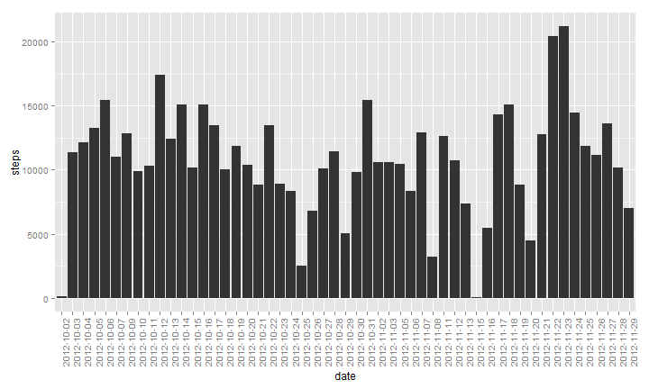
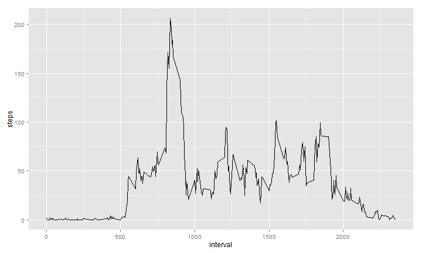
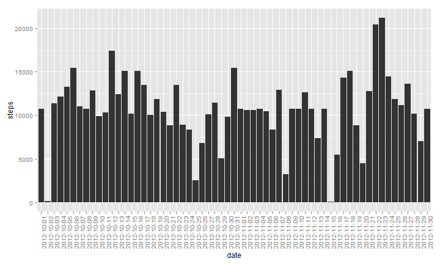
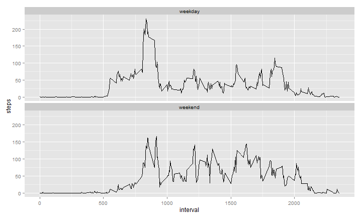

#### Loading and preprocessing the data

```r
setwd("C:/Users/Robert/Dropbox/Coursera/Reproducible Research/week2/RepData_PeerAssessment1")
library(ggplot2)
actdf <- read.csv("activity.csv")
```

#### Calculate the total number of steps taken per day

Sum the number of steps by date. The default for the "formula" class of aggregate is "na.action=na.omit".


```r
aggdf <- aggregate(steps ~ date, 
    data=actdf, 
    FUN=sum)
```

#### Make a histogram of the total number of steps taken each day


```r
ggplot(aggdf, aes(x=date)) + 
    geom_histogram(aes(y=steps), stat="identity") + 
    theme(axis.text.x = element_text(angle=90, hjust=1, size=10))
```

 

#### What is mean total number of steps taken per day?

*Calculate and report the mean and median of the total number of steps taken per day.*


```r
mean(aggdf$steps)
```

```
## [1] 10766.19
```

```r
median(aggdf$steps)
```

```
## [1] 10765
```

#### What is the average daily activity pattern?

*Make a time series plot (i.e. type = "l") of the 5-minute interval (x-axis) and the average number of steps taken, averaged across all days (y-axis).*

Here I'm reusing the "agg" variable, but now it contains an aggregation of steps by interval, and the mean of each interval across all days.


```r
agg <- aggregate(steps ~ interval, data=actdf, FUN=mean)
ggplot(agg, aes(x=interval, y=steps)) + geom_line()
```

 

*Which 5-minute interval, on average across all the days in the dataset, contains the maximum number of steps?*


```r
agg[which.max(agg$steps),]
```

```
##     interval    steps
## 104      835 206.1698
```

#### Imputing missing values

*Calculate and report the total number of missing values in the dataset (i.e. the total number of rows with NAs)*


```r
nrow(actdf[is.na(actdf$steps),])
```

```
## [1] 2304
```

*Devise a strategy for filling in all of the missing values in the dataset. The strategy does not need to be sophisticated. For example, you could use the mean/median for that day, or the mean for that 5-minute interval, etc.*

Because there is a wide disparity in the number of steps between intervals within each day, it makes sense to fill in each missing value with the mean for the same interval across all days.

*Create a new dataset that is equal to the original dataset but with the missing data filled in.*

Make a copy of the original data frame


```r
actnew <- actdf
```

Create a new data frame using the aggregate function. Sum the number of steps by date. The default for the "formula" class of aggregate is "na.action=na.omit".


```r
agg <- aggregate(steps ~ interval, data=actnew, FUN=mean)
```

Merge the original data frame (actnew) with the aggregated data frame (agg). This adds a column (steps.y) that contains the mean for each interval across all days.


```r
actnew = merge(actnew, agg, by="interval", all.x=T)
```

Replace NAs in the steps.x column with the mean for that interval across all days, which is contained in the steps.y column. This data frame is equivalent to the original data frame except that the missing values have been filled in as accurately as possible.


```r
# Replace NAs with mean of interval
actnew$steps.x[is.na(actnew$steps.x)] <- actnew$steps.y[is.na(actnew$steps.x)]
# Rename column "steps.x" to "steps"
names(actnew)[names(actnew)=="steps.x"] <- "steps"
# Drop the "steps.y" column
actnew <- actnew[, c("steps", "date", "interval")]
```

*Make a histogram of the total number of steps taken each day and Calculate and report the mean and median total number of steps taken per day. Do these values differ from the estimates from the first part of the assignment? What is the impact of imputing missing data on the estimates of the total daily number of steps?*


```r
agg2 <- aggregate(steps ~ date, data=actnew, FUN=sum)
ggplot(agg2, aes(x=date)) + 
    geom_histogram(aes(y=steps), stat="identity") + 
    theme(axis.text.x = element_text(angle=90, hjust=1, size=10))
```

 

To compare the mean and median of the number of steps per day before and after replacing NAs, we aggregate the actnew data frame by steps and interval, taking the mean and store the resulting data frame into the "agg3" variable. We already have the "before" data in the "agg" variable.


```r
agg3 <- aggregate(steps ~ interval, data=actnew, FUN=mean)
```

Here are the median and mean of the total number of steps taken per day when NAs were omitted (the "before" data).


```r
mean(agg$steps)
```

```
## [1] 37.3826
```

```r
median(agg$steps)
```

```
## [1] 34.11321
```

Here's the median and mean of the total number of steps per day after filling in NA values with the mean of their intervals across all days.


```r
mean(agg3$steps)
```

```
## [1] 37.3826
```

```r
median(agg3$steps)
```

```
## [1] 34.11321
```

I'm at a loss to explain this; the mean and median for the before and after cases are identical. I've checked the work several times and can attest that the missing values are being replaced. I compared the original data frame (actdf) with the data frame where the NAs were replaced, and they are different. In particular, the sum of the steps in replaced data frame is 15% higher than the sum of the step in the original data frame. This difference can only be explained by the replacement of the NA values.


```r
sum(actnew$steps) # the replaced data frame
```

```
## [1] 656737.5
```

```r
sum(actdf$steps, na.rm=TRUE)  # the original data frame
```

```
## [1] 570608
```

```r
(sum(actnew$steps) - sum(actdf$steps, na.rm=T))/(sum(actdf$steps, na.rm=T))
```

```
## [1] 0.1509434
```


#### Are there differences in activity patterns between weekdays and weekends?

*Create a new factor variable in the dataset with two levels - "weekday" and "weekend" indicating whether a given date is a weekday or weekend day.*

convert the date column, add a "daytype"" column, setting it equal to "weekend" or "weekday", as appropriate. Then convert the "daytype" column to a factor.


```r
actnew$date <- strptime(as.character(actnew$date), format="%Y-%m-%d")
actnew$daytype <- ifelse(actnew$date$wday == 0 | actnew$date$wday == 6, "weekend", "weekday")
actnew$daytype <- as.factor(actnew$daytype)
```

*Make a panel plot containing a time series plot (i.e. type = "l") of the 5-minute interval (x-axis) and the average number of steps taken, averaged across all weekday days or weekend days (y-axis). See the README file in the GitHub repository to see an example of what this plot should look like using simulated data.*


```r
agg3 <- aggregate(steps ~ interval + daytype, data=actnew, FUN=mean)
p <- ggplot(agg3, aes(interval, steps)) + geom_line()
p + facet_wrap(~daytype, ncol=1)
```

 
